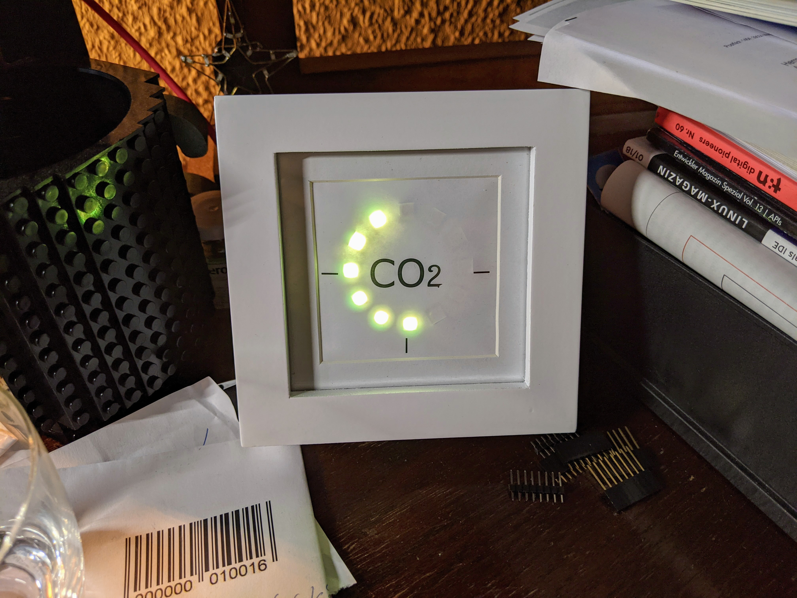
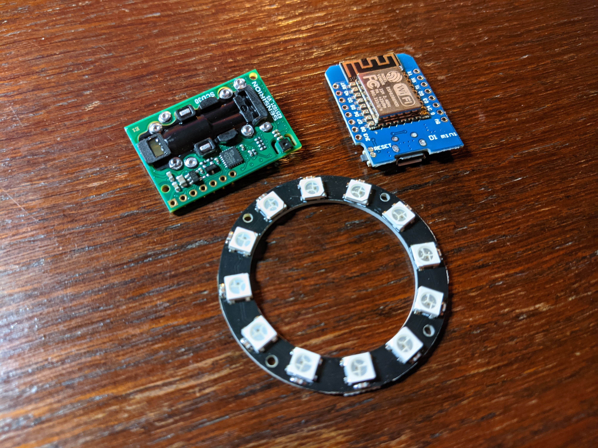
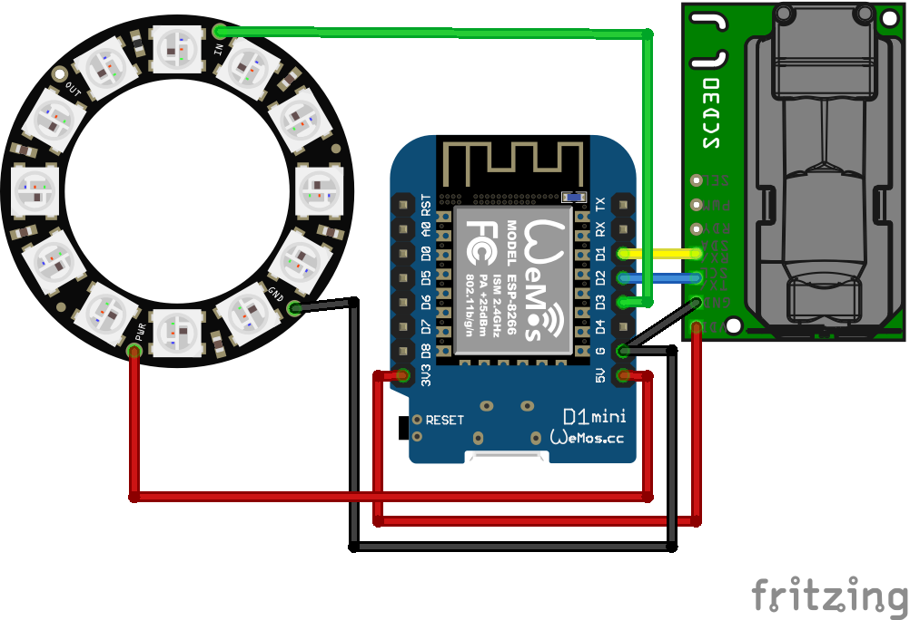
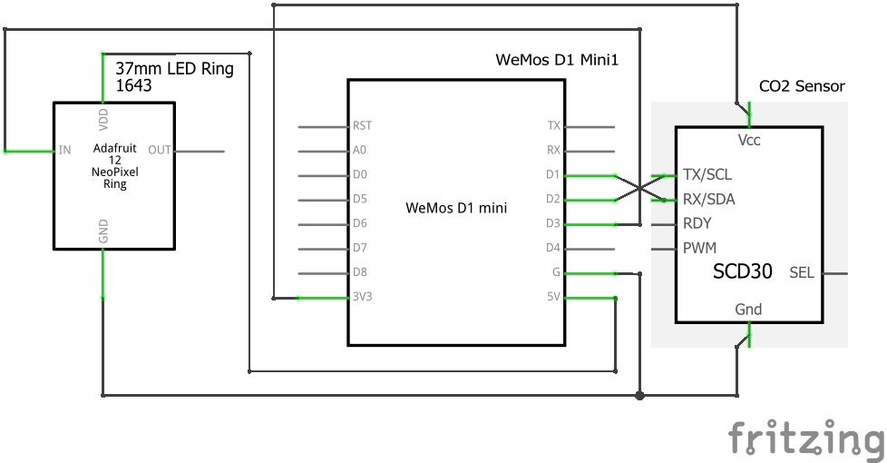
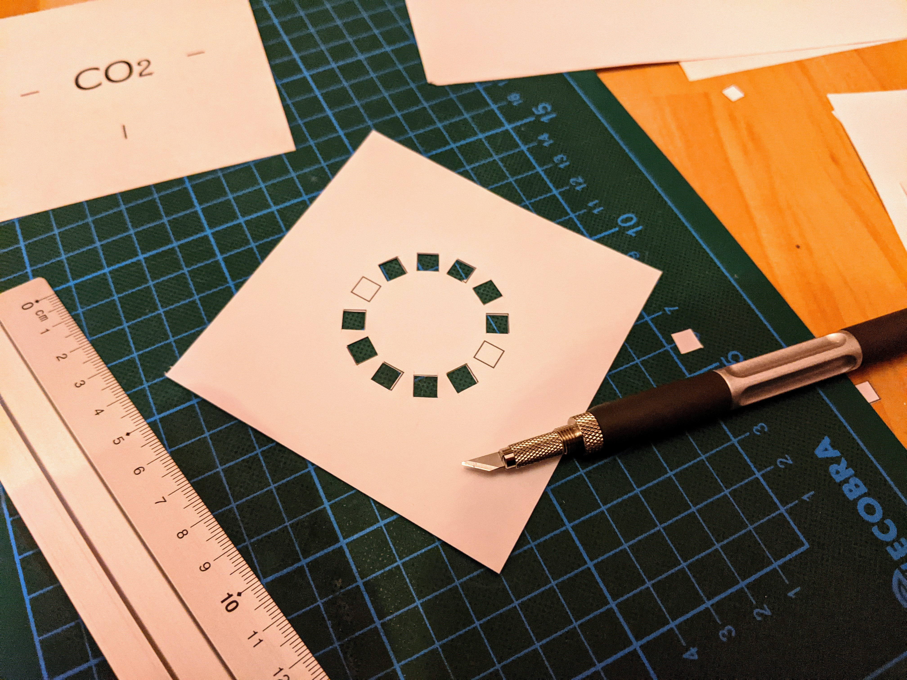
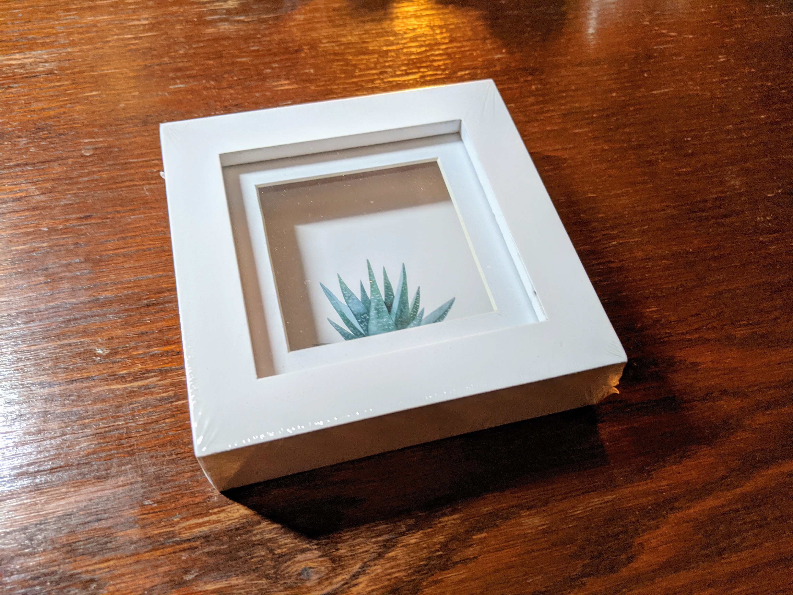
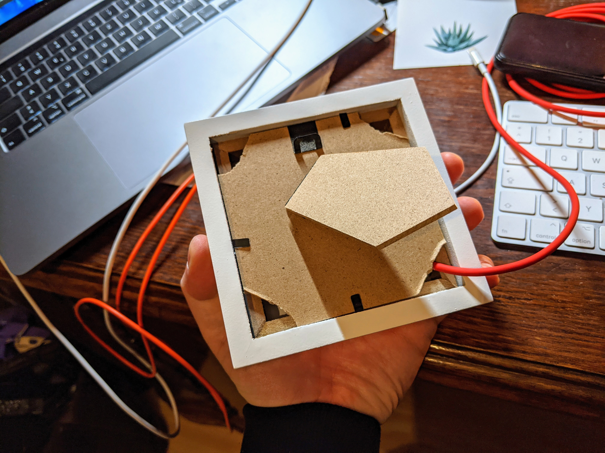

# CO2-Ampel

Angeregt durch den "CO2-Warner für die Schule" Artikel im MAKE: Magazin 5/2020 {1] habe ich einen CO2 Warner für mein Home Office gebaut.

Zu viel CO2 in der Raumluft vermehrt nicht nur Ansteckungen, sondern führt auch zu starken Kopfschmerzen, Leistungsabfall, Konzentrationsschwäche und zu erhöhter Atemfrequenz.

Je nach CO2 Anteil in der Luft nimmt die LED Anzeige des Sensor zu. Dabei Ändert sich die Farbe aller LEDs von Grün ("gute" Luft), über Orange bis zu Rot. Steigt der Wert über 2000 ppm, fängt die Anzeige zusätzlich an zu blinken. Dann sollte dringend gelüftet werden.

## BOM

- Sensirion SCD30 (https://a.aliexpress.com/_mq1Fatr)
- Wemos D1 Mini (https://www.amazon.de/dp/B08BTYHJM1/ref=cm_sw_r_cp_apa_fabc_Veo3Fb7N104TA)
- 37mm RGB LED Ring (https://www.amazon.de/dp/B07PFFJ8TF/ref=cm_sw_r_cp_apa_fabc_Nfo3FbM20TVWF)
- Kupferschaltdraht 0,5mm ca. 20cm
- 10x10cm Bilderrahmen aus dem dm-Drogerie-Markt (https://www.dm.at/paradies-quadratischer-diy-bilderrahmen-sort-p4058172406720.html)
- 1 Blatt DIN A4 Papier mit 70g
- 2 Blatt DIN A4 Papier mit 110g
- 1 Micro USB Kabel (https://de.aliexpress.com/item/32858516897.html)

## Zusammenbau Elektronik

Die Anschlüsse anhand der Zeichnungen oben mit dünnem Draht (Kupferschaltdraht 0,5mm) verbinden. Je nachdem, ob ihr Tx/Rx und D1/D2 richtig oder "falsch" verbunden hab, müsst ihr `Wire.begin(D2, D1);` im Code noch anpassen. (D1 und D2 vertauschen!)

## Software Installation

In der Arduino IDE den ESP8266 - Wemos D1 Mini / R1 auswählen. falls noch nicht vorhanden, vorher die ESP8266 Boards hinzufügen.

Danach den Sketch aus dem `/Arduino` Ordner öffnen und auf den Wemos laden.

## Anzeige / Passepartout

Aus dem `/Schnittmuster` Ordner das Dokument "Anzeige" auf das 70g papier und das Dokument "Passepartout" auf das 110g papier drucken.

Eines der beiden Passepartouts mit einem Cutter-Messer und Stahllineal ausschneiden. Das zweite Passepartout dient als "Trennschicht" zwischen LED Ring und Wemos/CO2 Sensor.

## Zusammenbau

Den Bilderrahmen auspacken und die Ecken des Rückteils am besten mit einem Cutter-messer und Stahllineal abschneiden, damit genügend Zirkulation entsteht.

Nun die "Anzeige" auf das Glas legen. Das ausgeschnittene Passepartout über die einzelnen LEDs "stülpen". Das zweite Passepartout mit einem Ausschnitt für die Kabel des LED Ring versehen und zwischen Ring und Wemos/Sensor stecken. Gegebenfalls mit etwas Tesa fixieren. Das USB Kabel einstecken und alles zusammen in den Bilderrahmen, auf die Anzeige legen. Als nächstes den inneren Rahmen wieder einfügen. Nun den Decken mit den fehlenden Ecken wieder montieren und den Bilderrahmen "verriegeln". 

et voilà

[1] Zum Artikel aus dem MAKE: Magazin: https://www.heise.de/select/make/2020/5/2022015381334973804
